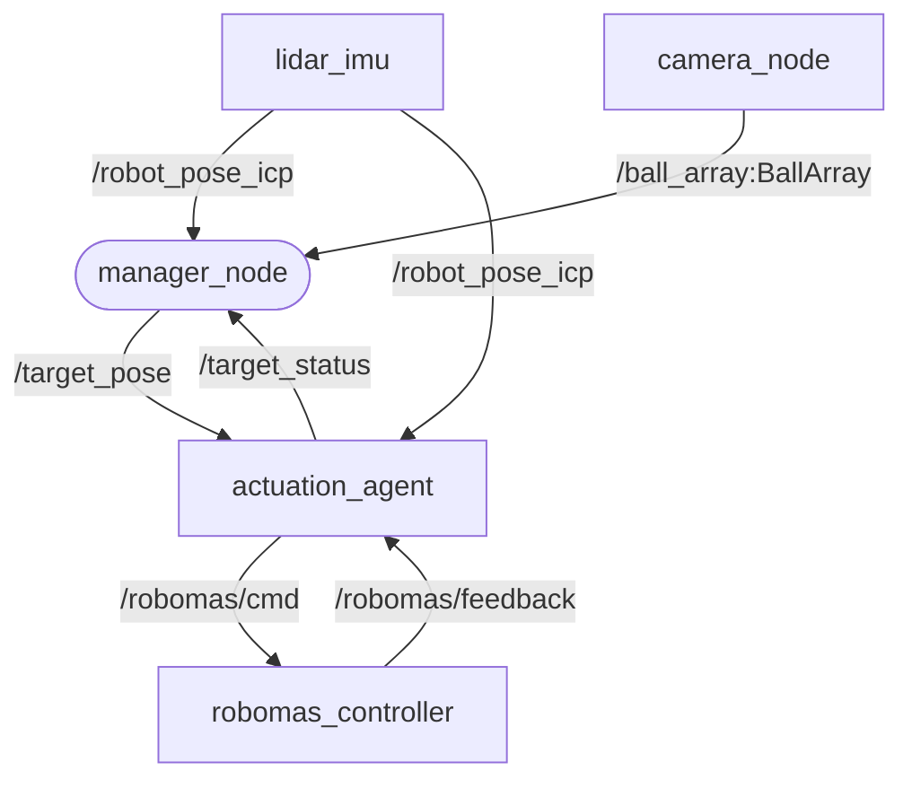

## まず初めに
 新規ターミナルでは`source install/setup.bash`を一度実行することでros2内の環境変数ないしはros2コマンドを有効化できます

ポート権限を与えるために`sudo chmod 777 /dev/ttyACM0` `sudo chmod 777 /dev/ttyACM1`を実行しておいてください

また、imuに使ってるポートと競合するのでimuより先にロボマスコントローラー基盤を接続しましょう。
 
# launchファイルの解説
```ros2 launch self_driving PrepareAll.launch.py```はこのパッケージを利用するための依存関係にある他パッケージのlaunchファイルをすべて起動します。

`ros2 launch self_driving My.launch.py`はこのパッケージの実行可能ノードをすべて起動します

# ノード説明

manager_node: 全体のルート/操作設計(射出/把持)

camera_node(仮): 画像からボールと色とカメラ基準の座標を導く

actuation_agent: target_poseを受けてモーターを動かす(icpを座標系変換に使うがそれ以外は単純に機体のモーター制御の中間層)



自作ノード名|役割
--|--
manager_node|大まかな操作の流れを指令
actuation_agent|うまく指令通りに機体を動かす

まずmanager_nodeについて
今回やるべきことは以下の繰り返しになります。
1. ノーツゾーンに行く
2. "近い色"の目の前に行く
3. とる動作をする(把持)
4. "近い色"のノーツの箱の目の前まで行く
5. 射出

ただしこの試合中while文をずっと回すわけにはいかないし、ros2で動くのは所謂callbackなのでクラス変数をフル活用します。
クラス変数にこの制御ループのそれぞれの操作(例."5.射出")をvectorの要素として持たせて、それぞれトピックの値などの条件を満たしたときにindexを進めて、その次からは進んだindexに格納された処理が次からのmain_callbackで繰り返される仕組みです。
これにはvectorの操作で制御の順番がいじれたり、制御を付け足したりできる利点があります。
この格納した関数らを便宜上seq(シークエンス)関数と呼ぶことにします

関数|目的
--|--
pursuit(x,y,yaw)<br>[seq関数]|map座標(x,y,yaw)へ向かいます<br>終了条件:誤差が閾値以下
unfold_route(name)<br>[seq関数]|座標列(`name`)をたどるようにpursuit(x,y,yaw)をpromise_chainに展開します<br>終了条件:遂行
unfold_pick(color)<br>[seq関数]|`color`色のボールを拾います<br>終了条件:遂行
shoot(color)<br>[seq関数]|`color`色のノードの直前まで進みshootキューを発行します<br>終了条件:`/status`=true
callback_manager|各seq関数の終了条件(seq関数がtrueを返す)とともに`promise_chain`を遷移させます

### actuation_agent
関数|目的
--|--
to_mapframe([/target])|map座標系での座標に向かいます
shoot(void)<br>- [/robomas/cmd],<br>- [/robomas/feedback]|射出機構の速度を裏で調整して撃鉄がうまく一周して戻るようにする


## topicやmessageについて
topic/message|意味
--|--
[topic]target_pose|ワールド座標上の目標点と目標姿勢の仕組み
[msg]Target:(x,y,yaw)
(x1,y1,yaw)→(x2,y2,yaw)|機体はある向き(yaw)を向きながら平行移動
(x,y,yaw1)→(x,y,yaw2)|機体はyaw1からyaw2へ(近いほうの向きに)回転
(x1,y1,yaw1)→(x2,y2,yaw2)|平行移動しながら回転(はじめ回転方向に少し膨らむ軌道になるがある程度補正されたら平行移動)

[topic]ball_array:リアルタイムに見えるボールの色と位置の配列
[msg]BallArray: (Ball[])

ボールキャッシュの保存：
キャリブレーションを吸収するためボールの平均を記録します
具体的にはjティック目のi番目のボールの座標をmap座標系で$(x_{i(j-1)},y_{i(j-1)})$としたときに次のtickで来る$(x_j,y_j)$がボールiの座標から一定距離d以下の範囲の時$x_{ij} = \frac{x_j+(j-1)x_{i(j-1)}}{j},y_{ij} = \frac{y_j+(j-1)y_{i(j-1)}}{j}$とする。
これはBallChache.hppとして作成されました。

## my_tf2について
直観的な座標変換を目指した自作クラス。
SO2の平面自由度でのユニタリ変換は基準となる姿勢の(+x,+y)=>(+yaw)=>の合成で表せるために、その変換を自動化してしまおうという思想
```cpp
#include "my_tf2.hpp"
//宣言時
Frame frameA("A");
Frame frameB("B");
```
`frameB.set_base(frameA(x,y,th))`はframeA座標系における(x,y)の点をframeBの原点とし、thの角度へx軸を伸ばすという意味。これは座標系のリンクとしてframeAとframeBの両方に保存され、何回も呼び出されたときは最新のリンクのみが有効になる。また、frameAとframeBのリンク、frameBとframeCのリンクを設定している時はframeAとframeCの変換ができるようになり、ここでframeAとframeCのリンクが今までとつじつまが合わないように設定されたときはframeAとframeCのリンクのみ有効になる。
また、リンクがつながってない座標系同士で変換しようとすると"Frame not reachable"エラーをはいてそのソース全体の処理を止める。(stdexceptを使ってるがノードが正常終了するかは試してないので不明)

座標変換時は
```cpp
my_tf2::Pose pos = frameB(frameA(x,y,th));
printf("座標系: %sでの座標(%lf,%lf,%lf)",pos.frame.name,pos.x,pos.y,pos.th);

```
これは座標系A上の座標(x,y,th)を座標系Bで表したときの座標が返ってくるように実装している
